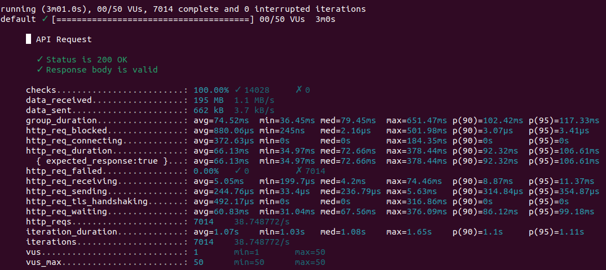

# Soal Eksplorasi

1.  Tulis kesimpulan dari hasil pengujian berikut.

Jawaban :
Gambar diatas menunjukkan sedang mengetest suatu software yang dimana software tersebut merupakan software API. Dapat terlihat API Request yang dimana pengecekan terrsebut sudah 100% tanpa adanya kerusakan/bug pada suatu software API tersebut.